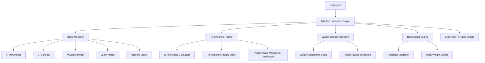
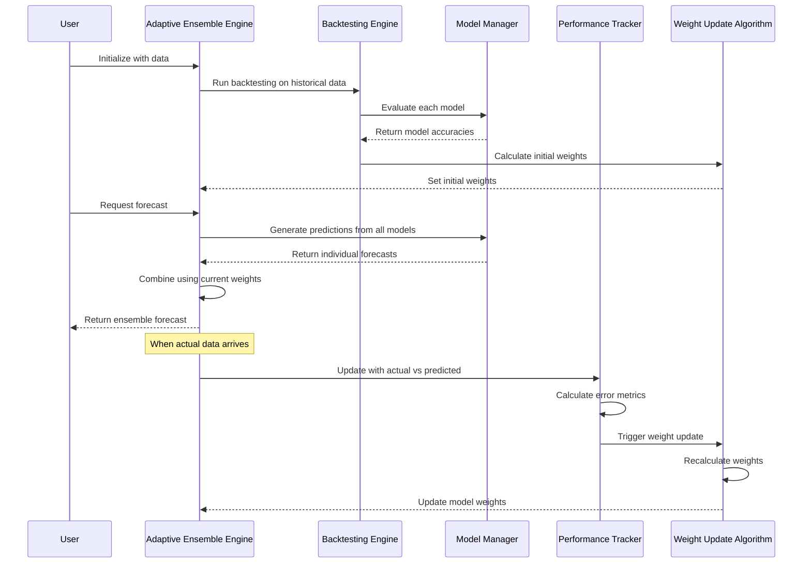

# Adaptive Ensemble Forecasting Engine Design

## Overview

The Adaptive Ensemble Forecasting Engine enhances the existing ensemble forecaster with intelligent weight learning capabilities. The system automatically determines optimal model combinations through backtesting, continuously monitors model performance, and adapts weights in real-time to maintain peak forecasting accuracy.

The design follows a modular architecture that extends the current `EnsembleForecaster` class while maintaining full backward compatibility. The system implements a continuous learning loop that evaluates model performance against actual outcomes and adjusts ensemble weights using mathematical algorithms based on inverse error relationships.

## Architecture

### High-Level Architecture



### Component Interaction Flow



## Components and Interfaces

### 1. AdaptiveEnsembleForecaster

**Purpose**: Main orchestrator that extends EnsembleForecaster with adaptive capabilities.

**Key Methods**:
```python
class AdaptiveEnsembleForecaster(EnsembleForecaster):
    def __init__(self, adaptive_learning=True, learning_window=30, min_weight=0.05)
    def fit_with_backtesting(self, data, validation_split=0.3)
    def update_with_actuals(self, actual_values, forecast_dates)
    def get_weight_history(self) -> pd.DataFrame
    def get_performance_metrics(self) -> Dict[str, Dict[str, float]]
    def enable_adaptive_learning(self, enabled=True)
```

**Interfaces**:
- Inherits all methods from `EnsembleForecaster`
- Adds adaptive learning configuration
- Provides performance monitoring capabilities

### 2. BacktestingEngine

**Purpose**: Evaluates model performance on historical data to establish initial weights.

**Key Methods**:
```python
class BacktestingEngine:
    def __init__(self, validation_periods=12, metrics=['mae', 'mape', 'rmse'])
    def run_backtest(self, models: Dict, data: pd.Series) -> Dict[str, Dict[str, float]]
    def calculate_initial_weights(self, performance_results: Dict) -> Dict[str, float]
    def cross_validate(self, model, data: pd.Series, folds=5) -> Dict[str, float]
```

**Interfaces**:
- Takes model dictionary and historical data
- Returns performance metrics for each model
- Calculates optimal initial weight distribution

### 3. PerformanceTracker

**Purpose**: Monitors ongoing model performance and maintains historical accuracy records.

**Key Methods**:
```python
class PerformanceTracker:
    def __init__(self, learning_window=30, metrics=['mae', 'mape', 'rmse'])
    def update_performance(self, model_name: str, predicted: float, actual: float, date: datetime)
    def get_recent_performance(self, model_name: str, days: int) -> Dict[str, float]
    def get_performance_history(self, model_name: str) -> pd.DataFrame
    def detect_performance_degradation(self, model_name: str, threshold=0.2) -> bool
```

**Data Storage**:
```python
@dataclass
class PerformanceRecord:
    model_name: str
    prediction_date: datetime
    predicted_value: float
    actual_value: float
    error_metrics: Dict[str, float]
    data_pattern: str  # seasonal, trending, intermittent, stationary
```

### 4. WeightUpdateAlgorithm

**Purpose**: Calculates new model weights based on recent performance metrics.

**Key Methods**:
```python
class WeightUpdateAlgorithm:
    def __init__(self, update_method='inverse_error', min_weight=0.05, smoothing_factor=0.1)
    def calculate_new_weights(self, performance_metrics: Dict[str, Dict[str, float]]) -> Dict[str, float]
    def apply_pattern_adjustments(self, weights: Dict[str, float], pattern_type: str) -> Dict[str, float]
    def smooth_weight_transitions(self, old_weights: Dict[str, float], new_weights: Dict[str, float]) -> Dict[str, float]
```

**Weight Calculation Algorithms**:

1. **Inverse Error Method**:
   ```python
   weight_i = (1 / error_i) / sum(1 / error_j for all j)
   ```

2. **Exponential Smoothing Method**:
   ```python
   weight_i = exp(-alpha * error_i) / sum(exp(-alpha * error_j) for all j)
   ```

3. **Rank-Based Method**:
   ```python
   weight_i = (n - rank_i + 1) / sum(n - rank_j + 1 for all j)
   ```

### 5. PatternDetector

**Purpose**: Identifies data patterns to inform model selection and weighting strategies.

**Key Methods**:
```python
class PatternDetector:
    def detect_pattern(self, data: pd.Series) -> str
    def calculate_seasonality_strength(self, data: pd.Series) -> float
    def detect_trend(self, data: pd.Series) -> Tuple[bool, float]
    def identify_intermittency(self, data: pd.Series) -> float
    def get_pattern_specific_weights(self, pattern: str) -> Dict[str, float]
```

**Pattern-Specific Initial Weights**:
- **Seasonal**: ARIMA(0.3), ETS(0.3), LSTM(0.25), XGBoost(0.1), Croston(0.05)
- **Trending**: ETS(0.35), LSTM(0.3), XGBoost(0.2), ARIMA(0.1), Croston(0.05)
- **Intermittent**: Croston(0.4), XGBoost(0.25), ARIMA(0.2), ETS(0.1), LSTM(0.05)
- **Stationary**: ARIMA(0.4), ETS(0.25), XGBoost(0.2), LSTM(0.1), Croston(0.05)

## Data Models

### Weight History Schema
```python
@dataclass
class WeightUpdate:
    timestamp: datetime
    model_weights: Dict[str, float]
    trigger_reason: str  # 'scheduled', 'performance_alert', 'pattern_change'
    performance_metrics: Dict[str, Dict[str, float]]
    pattern_detected: str
```

### Configuration Schema
```python
@dataclass
class AdaptiveConfig:
    adaptive_learning_enabled: bool = True
    learning_window_days: int = 30
    weight_update_frequency: str = 'weekly'  # 'daily', 'weekly', 'monthly'
    min_model_weight: float = 0.05
    max_weight_change_per_update: float = 0.2
    performance_alert_threshold: float = 0.2
    smoothing_factor: float = 0.1
    backtesting_validation_split: float = 0.3
```

## Error Handling

### Performance Monitoring Failures
- **Missing Actual Data**: Use last known performance metrics, log warning
- **Model Prediction Failures**: Exclude failed model from weight calculation, redistribute weights
- **Data Quality Issues**: Apply data quality scoring, adjust confidence in weight updates

### Weight Update Safeguards
- **Extreme Weight Changes**: Cap maximum weight change per update to prevent instability
- **Model Exclusion Prevention**: Maintain minimum weight threshold for all models
- **Convergence Issues**: Implement fallback to equal weights if algorithm fails

### Backtesting Robustness
- **Insufficient Historical Data**: Use cross-validation with available data
- **Model Training Failures**: Exclude failed models from initial weight calculation
- **Performance Metric Calculation Errors**: Use alternative metrics or default weights

## Testing Strategy

### Unit Testing
- **Weight Calculation Algorithms**: Test mathematical correctness of weight update formulas
- **Performance Tracking**: Verify accurate error metric calculations
- **Pattern Detection**: Test pattern identification accuracy on synthetic data
- **Backtesting Logic**: Validate historical performance evaluation

### Integration Testing
- **End-to-End Adaptive Learning**: Test complete learning cycle with simulated data
- **Backward Compatibility**: Ensure existing ensemble functionality remains intact
- **Multi-Model Coordination**: Test interaction between all forecasting models
- **Configuration Management**: Test various configuration combinations

### Performance Testing
- **Weight Update Efficiency**: Measure computational overhead of adaptive features
- **Memory Usage**: Monitor memory consumption with long-running performance history
- **Scalability**: Test with multiple time series and large datasets
- **Real-time Updates**: Verify timely weight updates under production loads

### Validation Testing
- **Forecast Accuracy Improvement**: Compare adaptive vs. static ensemble performance
- **Weight Convergence**: Verify weights stabilize for consistent data patterns
- **Pattern Adaptation**: Test weight adjustments when data patterns change
- **Robustness**: Test system behavior with noisy, missing, or corrupted data

## Implementation Considerations

### Performance Optimization
- Use vectorized operations for error metric calculations
- Implement efficient data structures for performance history storage
- Cache pattern detection results to avoid redundant calculations
- Optimize weight update frequency based on data volatility

### Scalability Design
- Support multiple time series with independent weight learning
- Implement parallel model training and evaluation
- Design for horizontal scaling with distributed computing
- Optimize memory usage for long-term performance history

### Monitoring and Observability
- Comprehensive logging of weight changes and reasons
- Performance dashboards for model accuracy trends
- Alerting for significant performance degradation
- Audit trails for all adaptive learning decisions

This design provides a robust foundation for implementing the adaptive ensemble forecasting engine while maintaining compatibility with existing systems and ensuring reliable, explainable performance improvements.