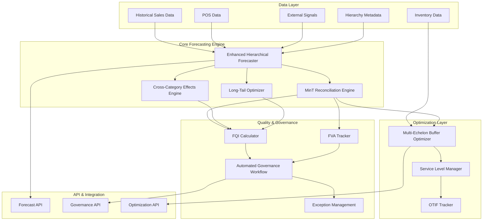

# Design Document: Advanced Demand Forecasting System

## Overview

The Advanced Demand Forecasting System extends the existing X-FORECAST platform with comprehensive demand planning, inventory optimization, and governance capabilities. The system builds upon the existing hierarchical forecasting foundation while adding MinT reconciliation, FVA tracking, FQI scoring, automated governance workflows, cross-category effects modeling, long-tail optimization, multi-echelon logic, and OTIF service level integration.

## Architecture

### High-Level Architecture



### System Components

The system consists of four main layers:

1. **Enhanced Forecasting Layer**: Builds on existing hierarchical forecasting with MinT reconciliation
2. **Quality & Governance Layer**: Implements FQI scoring, FVA tracking, and automated workflows
3. **Cross-Effects & Optimization Layer**: Handles cannibalization, halo effects, and long-tail optimization
4. **Multi-Echelon & Service Layer**: Manages buffer optimization and OTIF tracking

## Components and Interfaces

### 1. Enhanced Hierarchical Forecaster

**Purpose**: Extends existing `HierarchicalForecaster` with complete MinT reconciliation implementation.

**Key Enhancements**:
- Complete MinT reconciliation algorithm with proper error covariance matrix calculation
- Support for multiple reconciliation methods (MinT, OLS, WLS)
- Improved hierarchy structure validation
- Enhanced coherence scoring

**Interface**:
```python
class EnhancedHierarchicalForecaster(HierarchicalForecaster):
    def __init__(self, reconciliation_method: str = "mint"):
        super().__init__()
        self.reconciliation_method = reconciliation_method
        self.error_covariance_estimator = CovarianceEstimator()
    
    def mint_reconciliation_enhanced(self, base_forecasts: Dict[str, pd.Series], 
                                   historical_errors: Dict[str, pd.Series]) -> Dict[str, pd.Series]:
        """Enhanced MinT reconciliation with proper covariance estimation"""
        
    def validate_hierarchy_coherence(self, forecasts: Dict[str, pd.Series]) -> float:
        """Validate mathematical coherence of hierarchical forecasts"""
```

### 2. FVA Tracking System

**Purpose**: Track and measure the impact of human overrides on forecast accuracy.

**Key Features**:
- Override capture and versioning
- FVA calculation with multiple accuracy metrics
- User-level and product-level FVA analysis
- Automated alerting for negative FVA

**Interface**:
```python
class FVATracker:
    def __init__(self):
        self.override_history = OverrideDatabase()
        self.accuracy_calculator = AccuracyCalculator()
    
    def record_override(self, forecast_id: str, original_value: float, 
                       override_value: float, user_id: str, reason: str):
        """Record human override with metadata"""
    
    def calculate_fva(self, forecast_id: str, actual_value: float) -> FVAResult:
        """Calculate Forecast Value Added for specific override"""
    
    def analyze_user_fva(self, user_id: str, time_period: DateRange) -> UserFVAAnalysis:
        """Analyze FVA performance by user"""
```

### 3. Enhanced FQI Calculator

**Purpose**: Extends existing FQI calculator with additional metrics and automated triggers.

**Key Enhancements**:
- Integration with hierarchical coherence scores
- Real-time FQI monitoring and alerting
- Trend analysis and model retraining triggers
- Benchmark comparison with industry standards

**Interface**:
```python
class EnhancedFQICalculator(FQICalculator):
    def calculate_fqi_with_coherence(self, forecasts: Dict[str, pd.Series], 
                                   actuals: Dict[str, pd.Series],
                                   coherence_score: float) -> EnhancedFQIResult:
        """Calculate FQI including hierarchical coherence"""
    
    def monitor_fqi_trends(self, threshold: float = 70.0) -> List[Alert]:
        """Monitor FQI trends and generate alerts"""
```

### 4. Automated Governance Workflow Engine

**Purpose**: Implement automated weekly demand planning cycles with exception-based routing.

**Key Features**:
- Configurable workflow templates
- Exception detection and routing
- Automated reminders and escalations
- Integration with approval systems

**Interface**:
```python
class GovernanceWorkflowEngine:
    def __init__(self):
        self.workflow_templates = WorkflowTemplateManager()
        self.exception_detector = ExceptionDetector()
        self.notification_service = NotificationService()
    
    def initiate_weekly_cycle(self, cycle_date: datetime) -> WorkflowInstance:
        """Start automated weekly demand planning cycle"""
    
    def detect_exceptions(self, forecasts: Dict[str, pd.Series]) -> List[Exception]:
        """Detect forecast exceptions requiring human review"""
    
    def route_for_approval(self, exceptions: List[Exception]) -> List[ApprovalTask]:
        """Route exceptions to appropriate stakeholders"""
```

### 5. Enhanced Cross-Category Effects Engine

**Purpose**: Extends existing cross-category engine with improved cannibalization and halo effect modeling.

**Key Enhancements**:
- Machine learning-based effect detection
- Dynamic elasticity estimation
- Promotion impact simulation
- Portfolio optimization with cross-effects

**Interface**:
```python
class EnhancedCrossCategoryEngine(CrossCategoryEngine):
    def __init__(self):
        super().__init__()
        self.ml_effect_detector = MLEffectDetector()
        self.elasticity_estimator = DynamicElasticityEstimator()
    
    def detect_effects_ml(self, sales_data: pd.DataFrame) -> Dict[str, CategoryRelationship]:
        """Use ML to detect cross-category relationships"""
    
    def simulate_promotion_portfolio(self, promotions: List[Promotion]) -> PortfolioImpact:
        """Simulate impact of multiple simultaneous promotions"""
```

### 6. Long-Tail Optimizer

**Purpose**: Implement category-level optimization for sparse, intermittent demand items.

**Key Features**:
- Sparse item identification and clustering
- Category-level demand pooling
- Specialized forecasting methods (Croston's, TSB)
- Hierarchical borrowing from similar products

**Interface**:
```python
class LongTailOptimizer:
    def __init__(self):
        self.sparse_detector = SparseItemDetector()
        self.category_pooler = CategoryDemandPooler()
        self.intermittent_forecaster = IntermittentForecaster()
    
    def identify_sparse_items(self, sales_data: pd.DataFrame, 
                            sparsity_threshold: float = 0.1) -> List[str]:
        """Identify sparse/intermittent demand items"""
    
    def forecast_sparse_items(self, sparse_items: List[str], 
                            category_data: pd.DataFrame) -> Dict[str, pd.Series]:
        """Generate forecasts for sparse items using category-level pooling"""
```

### 7. Multi-Echelon Buffer Optimizer

**Purpose**: Optimize safety stock and buffer levels across the entire supply chain network.

**Key Features**:
- Network-aware buffer optimization
- Lead time and demand variability modeling
- Service level constraint handling
- Dynamic rebalancing during disruptions

**Interface**:
```python
class MultiEchelonOptimizer:
    def __init__(self):
        self.network_model = SupplyNetworkModel()
        self.buffer_calculator = BufferCalculator()
        self.service_level_manager = ServiceLevelManager()
    
    def optimize_network_buffers(self, network_config: NetworkConfig, 
                               service_targets: Dict[str, float]) -> BufferAllocation:
        """Optimize buffer levels across entire network"""
    
    def rebalance_for_disruption(self, disruption: SupplyDisruption) -> RebalancingPlan:
        """Dynamically rebalance buffers during supply disruptions"""
```

### 8. OTIF Service Level Manager

**Purpose**: Track and optimize On-Time In-Full delivery performance.

**Key Features**:
- Real-time OTIF tracking
- Root cause analysis for service failures
- Inventory-service level trade-off optimization
- Proactive service level management

**Interface**:
```python
class OTIFServiceManager:
    def __init__(self):
        self.otif_tracker = OTIFTracker()
        self.root_cause_analyzer = RootCauseAnalyzer()
        self.trade_off_optimizer = ServiceInventoryOptimizer()
    
    def track_otif_performance(self, orders: List[Order]) -> OTIFMetrics:
        """Track OTIF performance across all orders"""
    
    def analyze_service_failures(self, failed_orders: List[Order]) -> List[RootCause]:
        """Analyze root causes of service level failures"""
    
    def optimize_service_inventory_tradeoff(self, service_targets: Dict[str, float]) -> OptimizationResult:
        """Optimize inventory levels to meet service targets"""
```

## Data Models

### Core Data Structures

```python
@dataclass
class EnhancedForecastResult:
    """Enhanced forecast result with all quality metrics"""
    base_forecasts: Dict[str, pd.Series]
    reconciled_forecasts: Dict[str, pd.Series]
    fqi_scores: Dict[str, float]
    coherence_score: float
    cross_category_adjustments: Dict[str, float]
    confidence_intervals: Dict[str, Tuple[pd.Series, pd.Series]]
    quality_alerts: List[QualityAlert]

@dataclass
class FVAResult:
    """Forecast Value Added calculation result"""
    forecast_id: str
    original_accuracy: float
    override_accuracy: float
    fva_score: float
    fva_percentage: float
    user_id: str
    override_reason: str
    timestamp: datetime

@dataclass
class GovernanceWorkflowState:
    """State of automated governance workflow"""
    cycle_id: str
    cycle_date: datetime
    status: WorkflowStatus
    exceptions: List[ForecastException]
    pending_approvals: List[ApprovalTask]
    completed_tasks: List[CompletedTask]
    next_action_due: datetime

@dataclass
class MultiEchelonBufferPlan:
    """Multi-echelon buffer optimization plan"""
    network_id: str
    buffer_levels: Dict[str, Dict[str, float]]  # location -> product -> buffer
    service_level_projections: Dict[str, float]
    total_inventory_investment: float
    optimization_objective: str
    constraints_satisfied: bool
```

## Error Handling

### Exception Hierarchy

```python
class AdvancedForecastingError(Exception):
    """Base exception for advanced forecasting system"""
    pass

class ReconciliationError(AdvancedForecastingError):
    """Errors in hierarchical reconciliation"""
    pass

class FQICalculationError(AdvancedForecastingError):
    """Errors in FQI calculation"""
    pass

class GovernanceWorkflowError(AdvancedForecastingError):
    """Errors in automated governance workflows"""
    pass

class CrossCategoryModelingError(AdvancedForecastingError):
    """Errors in cross-category effects modeling"""
    pass

class MultiEchelonOptimizationError(AdvancedForecastingError):
    """Errors in multi-echelon optimization"""
    pass
```

### Error Recovery Strategies

1. **Reconciliation Failures**: Fall back to base forecasts with warning alerts
2. **FQI Calculation Errors**: Use simplified metrics and flag for manual review
3. **Workflow Failures**: Implement manual override paths and notification escalation
4. **Cross-Category Modeling Errors**: Disable cross-effects and use base forecasts
5. **Optimization Failures**: Use heuristic buffer levels based on historical performance

## Testing Strategy

### Unit Testing

- **Reconciliation Algorithm Testing**: Verify MinT reconciliation mathematical correctness
- **FVA Calculation Testing**: Test accuracy metrics and edge cases
- **FQI Component Testing**: Validate individual FQI component calculations
- **Cross-Category Effect Testing**: Test elasticity estimation and effect classification
- **Buffer Optimization Testing**: Verify optimization algorithm convergence

### Integration Testing

- **End-to-End Workflow Testing**: Test complete demand planning cycle
- **Data Pipeline Testing**: Verify data flow through all system components
- **API Integration Testing**: Test all external API interactions
- **Performance Testing**: Validate system performance under load

### Validation Testing

- **Historical Backtesting**: Validate forecast accuracy improvements
- **A/B Testing Framework**: Compare new system against existing methods
- **Business Logic Validation**: Ensure business rules are correctly implemented
- **User Acceptance Testing**: Validate workflow usability and effectiveness

### Performance Requirements

- **Forecast Generation**: Complete hierarchical forecasting for 10,000 SKUs in < 5 minutes
- **Reconciliation**: MinT reconciliation for 1,000-node hierarchy in < 30 seconds
- **FQI Calculation**: Real-time FQI scoring for individual forecasts in < 1 second
- **Workflow Processing**: Process weekly governance cycle for 50,000 forecasts in < 15 minutes
- **Cross-Category Analysis**: Analyze cross-effects for 500 categories in < 2 minutes

### Scalability Considerations

- **Horizontal Scaling**: Support distributed processing for large hierarchies
- **Caching Strategy**: Implement intelligent caching for frequently accessed forecasts
- **Database Optimization**: Optimize queries for historical data access
- **Memory Management**: Efficient memory usage for large-scale reconciliation operations
- **API Rate Limiting**: Implement rate limiting for external API calls