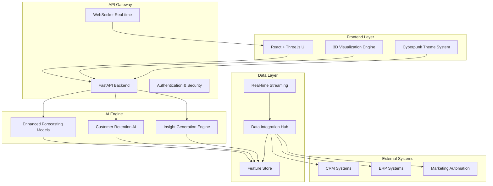

# Design Document

## Overview

The Cyberpunk AI Dashboard transforms the existing X-FORECAST engine into an immersive, futuristic business intelligence platform. The design leverages modern web technologies, 3D graphics, and advanced AI capabilities to create a cutting-edge user experience while maintaining enterprise-grade performance and scalability.

## Architecture

### High-Level Architecture



### Technology Stack

**Frontend:**
- React 18 with TypeScript for component architecture
- Three.js + React Three Fiber for 3D graphics
- Framer Motion for smooth animations
- Styled Components for cyberpunk theming
- WebGL shaders for advanced visual effects

**Backend:**
- FastAPI for high-performance API
- WebSocket for real-time updates
- Celery for background processing
- Redis for caching and session management

**AI/ML:**
- Enhanced existing ensemble models
- PyTorch for deep learning components
- Scikit-learn for customer analytics
- Transformers for natural language insights

**Data & Infrastructure:**
- PostgreSQL for structured data
- ClickHouse for time-series analytics
- Apache Kafka for real-time streaming
- Docker + Kubernetes for deployment

## Components and Interfaces

### 1. Cyberpunk UI Framework

**CyberpunkThemeProvider**
```typescript
interface CyberpunkTheme {
  colors: {
    neonBlue: '#00FFFF';
    hotPink: '#FF1493';
    acidGreen: '#39FF14';
    darkBg: '#0A0A0A';
    glowEffect: string;
  };
  effects: {
    glitch: GlitchEffect;
    hologram: HologramEffect;
    particles: ParticleSystem;
  };
  animations: {
    fadeIn: MotionVariant;
    slideUp: MotionVariant;
    pulse: MotionVariant;
  };
}
```

**3D Visualization Components**
```typescript
interface HolographicChart {
  data: TimeSeriesData[];
  type: 'line' | 'bar' | 'surface' | 'scatter3d';
  theme: CyberpunkTheme;
  interactions: InteractionConfig;
  effects: VisualEffects;
}

interface ParticleField {
  count: number;
  behavior: 'floating' | 'streaming' | 'reactive';
  color: string;
  size: number;
}
```

### 2. Enhanced Data Integration Layer

**UnifiedDataConnector**
```python
class UnifiedDataConnector:
    def __init__(self):
        self.connectors = {
            'crm': CRMConnector(),
            'erp': ERPConnector(),
            'marketing': MarketingConnector(),
            'existing': DataConnector()  # Extend existing
        }
    
    async def sync_all_sources(self) -> DataSyncResult:
        """Synchronize data from all connected systems"""
        pass
    
    def get_unified_customer_view(self, customer_id: str) -> CustomerProfile:
        """Aggregate customer data across all systems"""
        pass
```

**Real-time Data Streaming**
```python
class StreamingDataProcessor:
    def __init__(self, kafka_config: dict):
        self.kafka_consumer = KafkaConsumer(kafka_config)
        self.processors = {
            'sales': SalesStreamProcessor(),
            'customer_events': CustomerEventProcessor(),
            'inventory': InventoryStreamProcessor()
        }
    
    async def process_stream(self, topic: str, message: dict):
        """Process real-time data streams"""
        pass
```

### 3. Customer Retention Analytics Engine

**RetentionAnalyzer**
```python
class RetentionAnalyzer:
    def __init__(self):
        self.models = {
            'churn_prediction': ChurnPredictionModel(),
            'ltv_calculator': LTVCalculator(),
            'cohort_analyzer': CohortAnalyzer(),
            'segment_analyzer': SegmentAnalyzer()
        }
    
    def analyze_customer_retention(self, customer_data: pd.DataFrame) -> RetentionInsights:
        """Comprehensive retention analysis"""
        pass
    
    def predict_churn_risk(self, customer_features: dict) -> ChurnPrediction:
        """Predict individual customer churn probability"""
        pass
    
    def calculate_segment_retention(self, segment_id: str) -> SegmentRetention:
        """Calculate retention metrics for customer segments"""
        pass
```

**Integration with Forecasting**
```python
class IntegratedForecastingEngine(EnsembleForecaster):
    def __init__(self):
        super().__init__(use_ml=True)
        self.retention_analyzer = RetentionAnalyzer()
        self.customer_impact_model = CustomerImpactModel()
    
    def forecast_with_retention(self, demand_data: pd.DataFrame, 
                              customer_data: pd.DataFrame) -> EnhancedForecast:
        """Generate forecasts incorporating customer retention insights"""
        pass
```

### 4. AI Insight Generation System

**InsightEngine**
```python
class InsightEngine:
    def __init__(self):
        self.nlp_model = TransformerModel('insight-generation')
        self.pattern_detector = PatternDetectionModel()
        self.anomaly_detector = AnomalyDetectionModel()
    
    def generate_business_insights(self, data_context: dict) -> List[BusinessInsight]:
        """Generate natural language business insights"""
        pass
    
    def detect_opportunities(self, forecast_data: dict, 
                           retention_data: dict) -> List[Opportunity]:
        """Identify business opportunities from combined analytics"""
        pass
    
    def explain_predictions(self, prediction: dict) -> Explanation:
        """Provide explainable AI insights for predictions"""
        pass
```

### 5. AI Chatbot for Natural Language Queries

**ConversationalAI**
```python
class ConversationalAI:
    def __init__(self):
        self.nlp_processor = NLPProcessor()
        self.query_parser = QueryParser()
        self.context_manager = ConversationContextManager()
        self.response_generator = ResponseGenerator()
    
    def process_natural_language_query(self, query: str, user_context: dict) -> ChatResponse:
        """Process natural language queries about forecasts and analytics"""
        pass
    
    def generate_contextual_response(self, parsed_query: dict, 
                                   conversation_history: List[dict]) -> str:
        """Generate contextual responses with conversation memory"""
        pass
    
    def explain_forecast_in_plain_language(self, forecast_data: dict) -> str:
        """Convert technical forecast data into business-friendly explanations"""
        pass
```

**Query Processing Pipeline**
```python
class QueryParser:
    def __init__(self):
        self.intent_classifier = IntentClassifier()
        self.entity_extractor = EntityExtractor()
        self.query_validator = QueryValidator()
    
    def parse_business_query(self, query: str) -> ParsedQuery:
        """Parse natural language business queries into structured format"""
        pass
    
    def extract_forecast_parameters(self, query: str) -> ForecastParameters:
        """Extract forecast-specific parameters from natural language"""
        pass
```

### 6. Predictive System Health Monitoring

**PredictiveMaintenanceEngine**
```python
class PredictiveMaintenanceEngine:
    def __init__(self):
        self.health_monitor = SystemHealthMonitor()
        self.failure_predictor = FailurePredictionModel()
        self.maintenance_scheduler = MaintenanceScheduler()
        self.anomaly_detector = SystemAnomalyDetector()
    
    def predict_system_failures(self, metrics_history: pd.DataFrame) -> List[FailurePrediction]:
        """Predict potential system failures before they occur"""
        pass
    
    def analyze_performance_trends(self, system_metrics: dict) -> PerformanceAnalysis:
        """Analyze system performance trends and predict degradation"""
        pass
    
    def schedule_preventive_maintenance(self, predictions: List[FailurePrediction]) -> MaintenanceSchedule:
        """Schedule optimal maintenance windows based on predictions"""
        pass
```

**System Health Analytics**
```python
class SystemHealthAnalyzer:
    def __init__(self):
        self.metrics_collector = MetricsCollector()
        self.trend_analyzer = TrendAnalyzer()
        self.capacity_planner = CapacityPlanner()
    
    def collect_system_metrics(self) -> SystemMetrics:
        """Collect comprehensive system health metrics"""
        pass
    
    def analyze_resource_utilization(self, metrics: SystemMetrics) -> ResourceAnalysis:
        """Analyze resource utilization patterns and predict needs"""
        pass
    
    def generate_capacity_recommendations(self, usage_trends: dict) -> CapacityRecommendations:
        """Generate capacity planning recommendations"""
        pass
```

### 7. 3D Visualization Engine

**HolographicRenderer**
```typescript
class HolographicRenderer {
  private scene: THREE.Scene;
  private camera: THREE.PerspectiveCamera;
  private renderer: THREE.WebGLRenderer;
  private effects: EffectComposer;
  
  constructor(container: HTMLElement, theme: CyberpunkTheme) {
    this.initializeScene();
    this.setupCyberpunkEffects();
  }
  
  renderTimeSeriesHologram(data: TimeSeriesData[]): void {
    // Create 3D holographic time series visualization
  }
  
  renderCustomerJourney3D(journeyData: CustomerJourney): void {
    // Visualize customer journey in 3D space
  }
  
  addParticleEffects(config: ParticleConfig): void {
    // Add cyberpunk particle effects
  }
}
```

**Interactive Dashboard Components**
```typescript
interface DashboardLayout {
  mainView: '3d-hologram' | '2d-enhanced' | 'vr-mode';
  panels: DashboardPanel[];
  theme: CyberpunkTheme;
  realTimeUpdates: boolean;
}

interface DashboardPanel {
  id: string;
  type: 'forecast' | 'retention' | 'insights' | 'metrics';
  visualization: VisualizationConfig;
  dataSource: string;
  refreshRate: number;
}
```

## Data Models

### Enhanced Customer Data Model

```python
@dataclass
class CustomerProfile:
    customer_id: str
    demographics: CustomerDemographics
    transaction_history: List[Transaction]
    engagement_metrics: EngagementMetrics
    retention_score: float
    churn_probability: float
    lifetime_value: float
    segment: CustomerSegment
    journey_stage: str
    preferences: CustomerPreferences
    
@dataclass
class RetentionMetrics:
    retention_rate_30d: float
    retention_rate_90d: float
    retention_rate_365d: float
    cohort_performance: CohortMetrics
    churn_risk_factors: List[RiskFactor]
    recommended_actions: List[RetentionAction]
```

### Integrated Forecast Model

```python
@dataclass
class EnhancedForecast:
    demand_forecast: pd.Series
    confidence_intervals: Dict[str, pd.Series]
    customer_impact: CustomerImpactForecast
    retention_forecast: RetentionForecast
    business_insights: List[BusinessInsight]
    recommended_actions: List[BusinessAction]
    model_explanations: Dict[str, ModelExplanation]
    
@dataclass
class CustomerImpactForecast:
    new_customer_impact: float
    churn_impact: float
    segment_contributions: Dict[str, float]
    seasonal_customer_patterns: pd.Series
```

### Real-time Event Model

```python
@dataclass
class BusinessEvent:
    event_id: str
    timestamp: datetime
    event_type: EventType
    customer_id: Optional[str]
    product_id: Optional[str]
    value: float
    metadata: Dict[str, Any]
    impact_score: float
```

## Error Handling

### Graceful Degradation Strategy

```python
class GracefulDegradationManager:
    def __init__(self):
        self.fallback_strategies = {
            'data_source_unavailable': self.use_cached_data,
            'model_failure': self.use_backup_model,
            '3d_rendering_failure': self.fallback_to_2d,
            'real_time_failure': self.use_batch_updates
        }
    
    def handle_failure(self, failure_type: str, context: dict) -> FallbackResult:
        """Implement graceful degradation for various failure scenarios"""
        pass
```

### Real-time Monitoring

```python
class SystemHealthMonitor:
    def __init__(self):
        self.metrics_collector = MetricsCollector()
        self.alert_manager = AlertManager()
    
    def monitor_performance(self):
        """Continuous monitoring of system performance"""
        pass
    
    def check_data_quality(self, data_source: str) -> DataQualityReport:
        """Monitor data quality across all sources"""
        pass
```

## Testing Strategy

### Component Testing Approach

**Frontend Testing**
```typescript
// 3D Visualization Testing
describe('HolographicRenderer', () => {
  test('renders time series data in 3D space', () => {
    const renderer = new HolographicRenderer(mockContainer, cyberpunkTheme);
    const result = renderer.renderTimeSeriesHologram(mockTimeSeriesData);
    expect(result.scene.children).toHaveLength(expectedObjectCount);
  });
  
  test('applies cyberpunk visual effects correctly', () => {
    // Test shader effects, particle systems, etc.
  });
});

// Theme System Testing
describe('CyberpunkThemeProvider', () => {
  test('applies consistent styling across components', () => {
    // Test theme consistency
  });
});
```

**Backend Testing**
```python
class TestIntegratedForecastingEngine:
    def test_forecast_with_retention_integration(self):
        """Test integration of forecasting with retention analytics"""
        engine = IntegratedForecastingEngine()
        forecast = engine.forecast_with_retention(demand_data, customer_data)
        
        assert forecast.demand_forecast is not None
        assert forecast.customer_impact is not None
        assert len(forecast.business_insights) > 0
    
    def test_real_time_data_processing(self):
        """Test real-time data stream processing"""
        processor = StreamingDataProcessor(test_kafka_config)
        result = processor.process_stream('sales', mock_sales_event)
        
        assert result.processed_successfully
        assert result.updated_forecasts is not None
```

### Performance Testing

```python
class PerformanceTestSuite:
    def test_3d_rendering_performance(self):
        """Ensure 3D visualizations maintain 60fps"""
        pass
    
    def test_real_time_update_latency(self):
        """Verify real-time updates under 100ms"""
        pass
    
    def test_concurrent_user_load(self):
        """Test system performance with multiple concurrent users"""
        pass
    
    def test_large_dataset_processing(self):
        """Verify performance with enterprise-scale datasets"""
        pass
```

### Integration Testing

```python
class IntegrationTestSuite:
    def test_end_to_end_data_flow(self):
        """Test complete data flow from ingestion to visualization"""
        pass
    
    def test_external_system_integration(self):
        """Test integration with CRM, ERP, and marketing systems"""
        pass
    
    def test_ai_model_pipeline(self):
        """Test complete AI pipeline from data to insights"""
        pass
```

## Implementation Phases

### Phase 1: Foundation Enhancement (Weeks 1-2)
- Extend existing data connector for multiple sources
- Implement basic customer retention analytics
- Create cyberpunk theme system
- Set up enhanced backend architecture

### Phase 2: 3D Visualization Engine (Weeks 3-4)
- Implement Three.js-based 3D rendering
- Create holographic chart components
- Add cyberpunk visual effects and animations
- Integrate with existing forecasting data

### Phase 3: AI Integration (Weeks 5-6)
- Enhance forecasting models with customer data
- Implement insight generation engine
- Add real-time analytics capabilities
- Create integrated prediction pipeline

### Phase 4: Advanced Features (Weeks 7-8)
- Implement VR/AR viewing modes
- Add advanced customer journey visualization
- Create automated insight generation
- Optimize performance and add monitoring

This design provides a comprehensive blueprint for transforming the existing X-FORECAST system into a cutting-edge cyberpunk AI dashboard while maintaining the robust forecasting capabilities and adding powerful customer retention analytics.